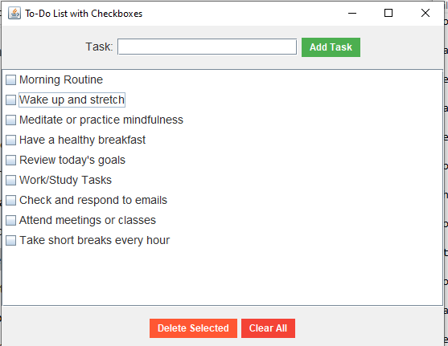
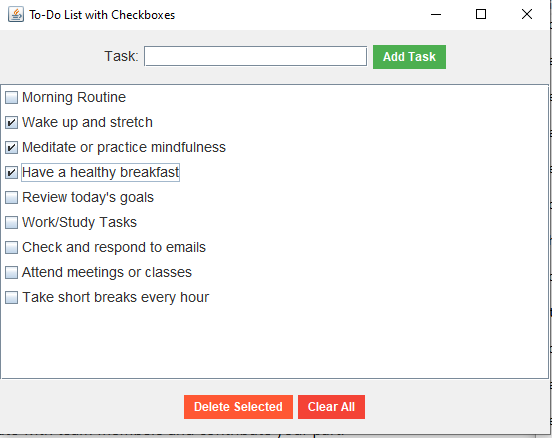
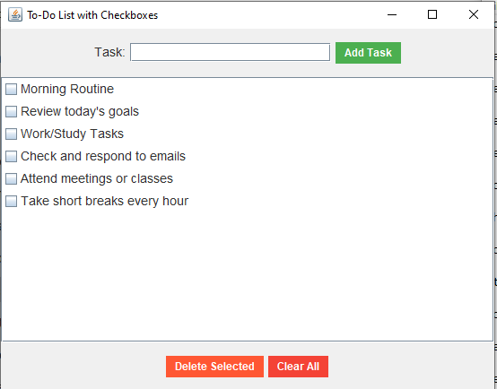
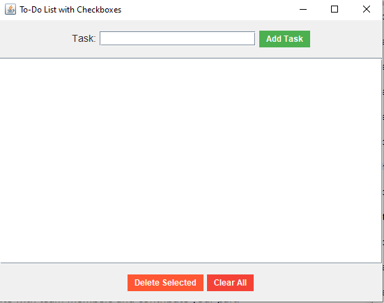

# To Do List Application
To-Do List App with Checkboxes
This is a simple To-Do List App built using Java and Swing for managing tasks. The app allows users to add, check off, delete, and clear tasks. It uses a CSV file to persist the tasks and their completion status, ensuring that tasks are saved across application restarts.

# Features
**Add Tasks**: Input a task and add it to the list.

•	**Checkbox**
 for Task Completion: Mark tasks as completed by checking/unchecking them.

•	
•	**Delete Selected Tasks:** Remove tasks that are marked as completed or selected.
•	
•	**Clear All Tasks:** 
Remove all tasks from the list.

•	
•	Persistent Storage: Tasks are saved and loaded from a CSV file to retain them between sessions.
•	User-Friendly Interface: Simple, easy-to-use graphical interface built with Java Swing.
Requirements
•	Java 8 or later: The application uses Swing and file I/O features that require at least Java 8.
•	Text Editor/IDE: Any text editor or IDE (like IntelliJ IDEA, Eclipse, or Visual Studio Code) for editing the code.
•	CSV File: The tasks are saved in a CSV file (tasks.csv), which the app reads and writes to.

git clone https://github.com/game-ale/to-do-list-app.git
"# To_Do_List" 
